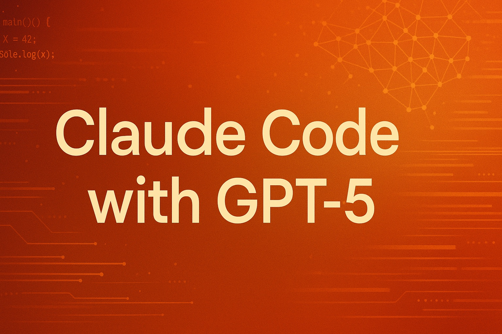

This repository lets you use **Anthropic's Claude Code** with **OpenAI's GPT-5** as the "smart" model via a local LiteLLM proxy.

## Quick Start ⚡

### Prerequisites

- [OpenAI API key](https://platform.openai.com/settings/organization/api-keys) 🔑
- [Anthropic API key](https://console.anthropic.com/settings/keys) 🔑 (optional, see note below)

**Note about the Anthropic API key**

The Anthropic API key is now **optional**. By default, this proxy remaps all Claude models to their GPT-5 equivalents:
- Claude Haiku → GPT-5-nano (minimal reasoning)
- Claude Sonnet → GPT-5 (medium reasoning)
- Claude Opus → GPT-5 (high reasoning)

You can customize these mappings in your `.env` file. If you want to still use some Claude models directly, you can set the Anthropic API key and adjust the remapping configuration.

**First time using GPT-5 via API?**

If you are going to use GPT-5 via API for the first time, **OpenAI may require you to verify your identity via Persona.** You may encounter an OpenAI error asking you to “verify your organization.” To resolve this, you can go through the verification process here:
- [OpenAI developer platform - Organization settings](https://platform.openai.com/settings/organization/general)

### Setup 🛠️

1. **Clone this repository**:
   ```bash
   git clone https://github.com/teremterem/claude-code-gpt-5.git
   cd claude-code-gpt-5
   ```

2. **Install [uv](https://docs.astral.sh/uv/)** (if you haven't already):

   **macOS/Linux:**
   ```bash
   curl -LsSf https://astral.sh/uv/install.sh | sh
   ```

   **macOS (using [Homebrew](https://brew.sh/)):**
   ```bash
   brew install uv
   ```

   **Windows (using PowerShell):**
   ```powershell
   powershell -c "irm https://astral.sh/uv/install.ps1 | iex"
   ```

   **Windows (using Scoop):**
   ```bash
   scoop install uv
   ```

   **Alternative: pip install**
   ```bash
   pip install uv
   ```

3. **Configure Environment Variables**:
   Copy the template file to create your `.env`:
   ```bash
   cp .env.template .env
   ```
   Edit `.env` and add your OpenAI API key:
   ```dotenv
   OPENAI_API_KEY=your-openai-api-key-here

   # Model remapping (default values shown, customize as needed)
   REMAP_CLAUDE_HAIKU_TO=gpt-5-nano-reason-minimal
   REMAP_CLAUDE_SONNET_TO=gpt-5-reason-medium
   REMAP_CLAUDE_OPUS_TO=gpt-5-reason-high

   # Optional: Only needed if you want to use Claude models directly
   #ANTHROPIC_API_KEY=your-anthropic-api-key-here
   ```

4. **Run the server**:
   ```bash
   uv run litellm --config config.yaml
   ```

### Using with Claude Code 🎮

1. **Install Claude Code** (if you haven't already):
   ```bash
   npm install -g @anthropic-ai/claude-code
   ```

2. **Connect to your proxy**:
   ```bash
   ANTHROPIC_BASE_URL=http://localhost:4000 claude
   ```

   The proxy will automatically use GPT-5 models based on your configured remapping. You can also explicitly specify a model:
   ```bash
   ANTHROPIC_BASE_URL=http://localhost:4000 claude --model gpt-5-reason-medium
   ```

   **Available models for the `--model` parameter:**
   - **GPT-5**:
      - `gpt-5-reason-minimal`
      - `gpt-5-reason-low`
      - `gpt-5-reason-medium`
      - `gpt-5-reason-high`
   - **GPT-5-mini**:
      - `gpt-5-mini-reason-minimal`
      - `gpt-5-mini-reason-low`
      - `gpt-5-mini-reason-medium`
      - `gpt-5-mini-reason-high`
   - **GPT-5-nano**:
      - `gpt-5-nano-reason-minimal`
      - `gpt-5-nano-reason-low`
      - `gpt-5-nano-reason-medium`
      - `gpt-5-nano-reason-high`

3. **That's it!** Your Claude Code client will now use **GPT-5** models automatically! 🎯

## What's New in v0.3.0

- **Automatic model remapping**: Claude models are now automatically mapped to GPT-5 equivalents
- **Anthropic API key is optional**: You no longer need an Anthropic API key if using only GPT-5 models
- **Improved configuration**: Model remapping can be customized via environment variables
- **Better error handling**: Enhanced proxy error messages and fallback behavior
- **Performance improvements**: Optimized request routing and model selection

## KNOWN PROBLEM

**The `Web Search` tool currently does not work with this setup.** You may see an error like:

```text
API Error (500 {"error":{"message":"Error calling litellm.acompletion for non-Anthropic model: litellm.BadRequestError: OpenAIException - Invalid schema for function 'web_search': 'web_search_20250305' is not valid under any of the given schemas.","type":"None","param":"None","code":"500"}}) · Retrying in 1 seconds… (attempt 1/10)
```

**WORKAROUND:** If your request requires searching the web, temporarily switch back to one of the Claude 4 models using the `/model` command in Claude Code. Claude models remain available alongside `gpt-5` and will use the Anthropic API key from your `.env`.

**The `Fetch` tool DOES work, though (getting web content from specific URLs).**

## P. S. You are welcome to join our [MiniAgents Discord Server 👥](https://discord.gg/ptSvVnbwKt)
